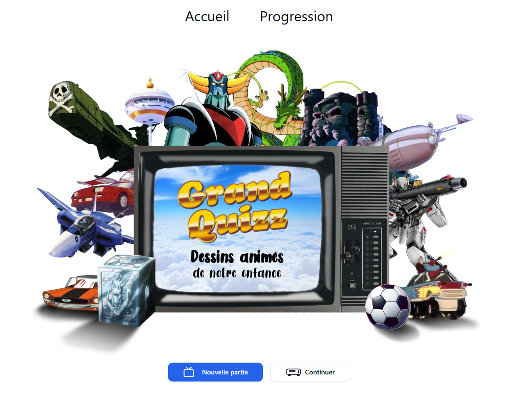

# Quiz Template

A template to easily create an image-based quiz application, based on [Next.js](https://nextjs.org/) / [Tailwind CSS](https://v3.tailwindcss.com/) / [shadcn](https://ui.shadcn.com/)


## Table of Contents

- [Features](#features)
- [Requirements](#requirements)
- [Create a New Project](#create-a-new-project)
- [Quick Start](#quick-start)
  - [Create quiz files](#create-quiz-files)
  - [Add your images](#add-your-images)
  - [Customize the app](#customize-the-app)
- [Interface customization](#interface-customization)
- [Additional features](#additional-features)
- [Deployment](#deployment)
- [Contributing](#contributing)
- [License](#license)
- [Support and Contact](#support--contact)
- [Quizz Template internals](#quizz-template-internals)

## Features

✅ Interactive image-based quiz  
✅ User score tracking and progression  
✅ Modern and responsive UI  
✅ Built with **Next.js** for optimal performance  
✅ Easy to customize and extend

## Requirements

Before you begin, make sure you have installed:

- **[Node.js](https://nodejs.org/)**
- **npm** or **yarn**

## Create a New Project

To create your own project based on this template, use the following steps:

```bash
# Create a new project using this template
git clone https://github.com/user/quiz-image-template.git my-quiz-app
cd my-quiz-app

# Remove the existing Git history to make it your own
rm -rf .git

# Initialize a new Git repository
git init

# Install dependencies
npm install  # or yarn install
```

Start the development server:

```bash
npm run dev  # or yarn dev
```

The app will be available at: **[http://localhost:3214](http://localhost:3214)**

## Quick start

You made the template running. Now, you can start creating your own quiz!

### Create quiz files

The quiz items are loaded from the `quizz-items.json` file located in `src/data`. You can directly edit this file, however, it is easier to fill in the `quizz-items.csv` file, also located in `src/data`. For each item, you need to provide 4 pieces of data:

- the **title**: it is the intended answer
- an **id**: must be unique. It is used to match the images with the quiz item
- a **video url** (optional): a video than can be visualized if the answer is correct
- a **list of accepted answers**, separated by commas: all the possible answers that should be considered as correct

Here is an example:
| title | id | videoUrl | acceptedAnswers |
|---------|----------|---------------------------------------------|------------------------------------------|
| MacGyver| macgyver | https://www.youtube.com/watch?v=yOEe1uzurKo | macgyver, mac gyver, macgiver, mac giver |

How it looks in the csv file:

```csv
title;id;videoUrl;acceptedAnswers
MacGyver;macgyver;https://www.youtube.com/watch?v=yOEe1uzurKo;macgyver,mac gyver,macgiver,mac giver
```

> !IMPORTANT
> Be sure to use `;` as separator

When your `quizz-items.csv` file is complete, **you can run a little script**, already configured in the `package.json` file, to generate the corresponding `quizz-items.json` file.

```bash
# At the root of the project
npm run db:populate
```

Now your `quizz-items.json` file looks like this:

```json
[
  {
    "title": "MacGyver",
    "id": "macgyver",
    "videoUrl": "https://www.youtube.com/watch?v=yOEe1uzurKo",
    "acceptedAnswers": ["macgyver", "mac gyver", "macgiver", "mac giver"],
    "hardHint": "assets/images/macgyver-hard.jpg",
    "easyHint": "assets/images/macgyver-easy.jpg",
    "index": "1"
  }
]
```

### Add your images

The next step is to add your images. In order to work without any further configuration, the following **conventions** must be respected:

- The images must be located in the `public/assets/images` folder.
- All images files must be `.jpg`.
- For each quiz item, there should be 2 images: 1 for the "hard hint" and 1 for the "easy hint". The naming convention is `<id>-hard.jpg` and `<id>-easy.jpg`. The ìd in the file name must match the id of the item. For our previous example, the images must be named `macgyver-hard.jpg`and `macgyver-easy.jpg`.

### Customize the app

> [!IMPORTANT]
> I don't know how to use Next.js! 😱

The minimal customization of the quiz consists in updating the title in the home page. It is really easy:

- open the `page.tsx` located in the `src/app` folder
- update the text inside of the `<p>` tags:

```tsx
import { NewGameButton } from "@/components/new-game-button";
import { ResumeGameButton } from "@/components/resume-game-button";

export default function Home() {
  return (
    <div className="...">
      <div className="...">
        <p className="...">Quizz title</p>    <--- update the title here
        <p className="...">Subtitle</p>       <--- update the subtitle here
      </div>
      <div className="...">
        <NewGameButton />
        <ResumeGameButton />
      </div>
    </div>
  );
}
```

That's it! Your quiz is ready for deployment!

You can have a look at the [deployment section](#deployment) for deploying on **GitHub Pages** (free).

## Interface customization

You may want to customize your app more. It is of course possible:

- **Styles**: this templates uses [Tailwind CSS](https://v3.tailwindcss.com/). See `src/app/globals.css` or `tailwind.config.ts` for configuration, and the Tailwind documentation for more details.
- **Components**: this template uses [shadcn](https://ui.shadcn.com/). Please check the shadcn documentation for more details, especially the [themes page](https://ui.shadcn.com/themes) for quick update of the overall app theming: copy the provided code and replace the existing corresponding one in `src/app/globals.css`

## Additional features

Of course, you are not limited by this template, which is only a bare bone for your fancy app!

You can take advantage of the power of Next.js and React to upgrade the app and give it additional features, like bonus or progression information.

See this live example based on this template, which includes additional functionalities in the Progression page.

[](https://antoinejoulia.github.io/quizz-dessins-animes/)

Code can be found at https://github.com/AntoineJOULIA/quizz-dessins-animes if you want to dig more in it.

## Deployment

If you want to deploy your quiz, the easiest way is to use **GitHub Actions** to deploy it on [**GitHub Pages**](https://pages.github.com/).

To do so, first go to **github.com**, on your **repository page**.
Then go to the **Settings** tab.


Then to Pages


Then choose **GitHub Actions**


Finally, select the proposed default Next.js configuration file (nextjs.yml). Commit, when proposed.

That's all!

Now, every time you push your code to the main branch, it will be automatically deployed.

**Congratulations**, your app is ready to be spread around!

## Contributing

Contributions are welcome! To propose an improvement:

1. Fork the project
2. Create a branch (`git checkout -b feature-my-feature`)
3. Commit your changes (`git commit -m 'Add my feature'`)
4. Push the branch (`git push origin feature-my-feature`)
5. Open a **Pull Request**

## License

This project is licensed under **GPL**. See the `LICENSE` file for more details.

## Support & Contact

If you have any questions or need help, contact us via **[GitHub Issues](https://github.com/user/quiz-image-template/issues)**

# Quizz Template Internals

I will paraphrase the [Redis README](https://github.com/redis/redis/blob/unstable/README.md): "_if you are reading this README you are likely in front of a GitHub page. Thus, you are basically one step away from the source code, so here we explain the source code layout, what is in each file as a general idea, the most important functions and structures_".

## General functioning

### Questions/answers management

The Quizz Template uses the `src/data/quizz-items.json` file as the basis for questions/answers management, including the paths to the images and videos.
Especially, each quizz-item has an "index" field used for navigation.

### Global state

There is no global state management. The application does not use React Context, but local storage to manage the progress and status of the player. Thus, a game can be resumed only on the same device/browser.
Each time the player submits an answer, the game status is updated in the local storage, by modifying the `quizz-status` item. This item contains a simple json object were the keys are the ids of the submitted quizz-items, and the values are their status: `correct` or `wrong`.
Every time the application needs to get the status of a given quizz-item, it looks in the local storage (see [hooks](#hooks) for more info).

## Source code layout

The Quizz Template root directory contains this README, the package.json and all the configurations files.

Inside the root are the following important directories:
`public`: contains the assets (images and fonts)
`src`: contains the Quizz Template implementation, written in TypeScript, and using the Next.js architecture and conventions. This directory is detailed hereafter, as it is the most important part of the code.

The `src` directory has the following structure:

```
src
├── app
├── components
├── data
├── hooks
├── lib
├── scripts
└── types.ts
```

### app

Quizz Template uses Next.js and its App directory. So if you want information on the general principles and conventions, please check their documentation.

The app directory structure is the following:

```
 app
 ├── [index]
 │   └── page.tsx
 ├── board
 │   └── page.tsx
 ├── favicon.ico
 ├── globals.css
 ├── layout.tsx
 └── page.tsx
```

It is very simple and straightforward:

- if you want to customize the **general layout** of the application, edit `app/layout.tsx`. There you can find the call to the `Header` component.
- if you want to customize the **home page**, edit `app/page.tsx`.
- if you want to customize the **progression page**, displaying the score and the status of the questions, edit `app/board/page.tsx`
- if you want to customize the **question page**, displaying the quiz questions, edit `app/[index]/page.tsx`
- if you wan to **add new pages**, add the corresponding folders directly in the `app` directory.

### components

This directory contains all the React components of the application:

- `header.tsx`: the top navbar.
- `new-game-button.tsx`: the button on the homepage creating a new game. Especially, it resets the stored status.
- `resume-game-button.tsx`: the button on the homepage enabling to resume an already started game. Sends the player to the first unresolved question (a quizz-item which status is not "correct").
- `image-toggle.tsx`: the component enabling the player to toggle between hard and easy image hints, as well as displaying the title hint in the form of the first letter of the answer, followed by the rest of the characters replaces by underscores.
- `answer-form.tsx`: the form enabling the player to submit its answer. If correct, shows the answer and a video (if the `videoUrl` field of the quizz-item is not empty). If wrong, shows the information with a message picked randomly from a list (see #lib).
- `answer-board.tsx`: the component showing the current score of the player, as well as the status of all the quizz-items. The player can directly navigate to a given quizz-item by clicking on it. The "back" button brings the player to the last visited page.

In addition, the `ui` folder contains all the shadcn components (see [dedicated documentation](https://ui.shadcn.com/docs/installation/next) for more info).

### data

Contains the data files `quizz-items.csv`and `quizz-items.json`. It also contains a shorter `quizz-items_sample.json`, which can be used for a more simple development / debugging.

### hooks

This directory is aimed at gathering the various hooks of your application.
By default, it contains only `useQuizzItemStatus.ts`, which manages the local storage, for retrieving and updating the status of the various quizz-items.

### lib

This directory contains the following files:

- `constants.ts` contains all the constants of the application. By default, there is only lists of messages to be displayed to the player in case of wrong answer.
- `utils.ts` contains various utility functions (formatting, conversions, etc.).
- `db.ts` is the facade for data access. Quizz Template only uses data from local files. But if you want to use a database, you should put your data access code here, respecting the current API, so no other modification of the code is required.

### scripts

This directory should contain only scripts that are not directly related to the application.
By default, it contains `populate.js`, which converts `quizz-items.csv` (easier to fill in) into `quizz-items.json` (used by the application).
A npm script is included in `package.json`, so this conversion can be done by running the following code from the root directory:

```bash
npm run db:populate
```
